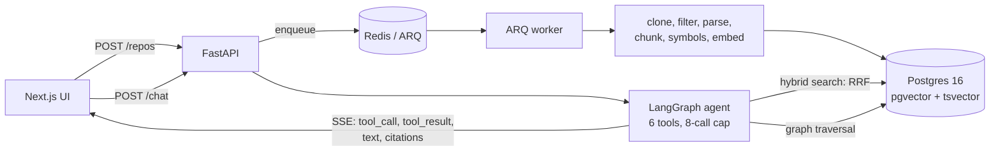

<!-- TODO(human): replace with demo.gif — submit a repo → progress bar advances →
     ask a question → tool timeline streams → answer with citations → click a
     citation → code viewer scrolls to the highlighted line range. ~20 seconds. -->

# Codebase Onboarding Assistant

Submit a public GitHub repo → it clones, chunks the code on AST boundaries
(tree-sitter), embeds the chunks, and builds a symbol graph of imports, calls,
and inheritance. Ask *"how does auth work?"* and a LangGraph agent finds entry
points with hybrid retrieval, then traverses the symbol graph to pull in the
dependent code retrieval missed — answering with `file:line` citations streamed
over SSE.

**Stack:** Python 3.11+, FastAPI, Postgres 16 + pgvector, tree-sitter, Jedi,
LangGraph, Next.js 15. Benchmark: [`encode/httpx`](https://github.com/encode/httpx)
pinned at `b5addb64`, 20 frozen questions with ground truth.

---

## The comparison

Three strategies on the same 20 frozen questions, same repo, same pin. Naive =
fixed 1000-character windows with 100 overlap; AST = chunks on tree-sitter
function/class boundaries; AST + agent = the same corpus with the LangGraph
agent traversing the symbol graph.

| | Naive chunking | AST chunking | AST + agent |
|---|---|---|---|
| chunks (same 60 files) | 657 | 1522 | 1522 |
| **Retrieval — hit@10** (hybrid, default) | **0.95** | **0.95** | n/a |
| hit@5 | 0.80 | 0.85 | n/a |
| hit@3 | 0.80 | 0.80 | n/a |
| MRR | 0.734 | 0.752 | n/a |
| vector hit@10 · fts hit@10 | 0.90 · 0.90 | 0.90 · 0.80 | n/a |
| **Answer — file-level** | not run | 0.90 | 0.90–0.95 |
| **Answer — symbol-level** | not run | 0.75 (Mistral) · 0.80 (Vertex) | 0.85–1.00 · 0.85–0.90 |
| **q10** — missed by every retrieval mode | miss | miss | **5/5 Mistral · 2/5 Vertex** (see below) |

Retrieval rows: `scripts/eval.py`, implementation-only condition, 2026-07-27
(naive re-run and reproduced question-for-question). Answer rows: the *stuffed*
baseline (top-10 pool, one model call) vs the agent, three controlled repeat
runs per model at temperature 0 — the AST-column figure is the baseline, the
agent column its range across runs.

**Read this table honestly: naive does not lose on hit@k.** Fixed 1000-character
windows match AST chunking at hit@10 on both hybrid (0.95) and vector (0.90),
and beat it on FTS (0.90 vs 0.80). Naive chunks are ~2.3× larger, which favours
them on a metric that only asks whether a ground-truth symbol landed *somewhere*
in a retrieved window. The window parameters were fixed before measurement and
were not adjusted afterwards. A baseline tuned until it loses is not evidence,
so this null result is reported as it came out.

What AST chunking buys is not hit@k on this benchmark — it is the symbol graph,
which fixed windows cannot produce (`build_graph` is forced off for the naive
row by design), and which is what the agent column rests on. The naive corpus
was never given an answer-level run; that measurement is available
(`answer_eval.py --repo <naive-id>`) and simply was not spent.

---

## The claim, and exactly how strong it is

The thesis is **"retrieval finds entry points; graph traversal finds the
answer."** It was tested against a *stuffed* baseline — one model call with the
top-10 retrieved chunks and the same citation contract — on 20 frozen questions,
across two model families. Three findings, ranked by the strength of their
evidence rather than by how good they sound:

### (a) MODEL-DEPENDENT — the graph reaches what retrieval cannot, on one model

**q10 — the only question no retrieval mode reaches in any condition — is
answered by the agent in 3/3 controlled temperature-0 runs on Mistral and 0/3
on Vertex (0/2 distinct results: two of Vertex's three blocks are byte-identical
and probably a double-append), or 5/5 and 2/5 across all runs, both Vertex hits
pre-temperature-pin: graph traversal can reach what retrieval cannot,
demonstrated on one model family and not reproduced on the other.**

q10 is missed by every retrieval mode — vector, FTS, hybrid, hybrid+rerank — in
both corpus conditions, on both the AST and naive corpora, re-verified
2026-07-27, and the stuffed baseline misses it in every run. It is the thesis's
falsifiable case: if graph traversal reaches anything retrieval cannot, it
should reach this. On one model family it does.

An earlier version of this section read "in every run, on both models". That was
written from the pre-temperature-pin runs and is **corrected here (2026-07-27)**;
the controlled Vertex runs contradict it. The correction, and how the error
survived, are recorded in [`docs/DECISIONS.md`](docs/DECISIONS.md).

**It is one question, and it replicates on one model family of two.**

The agent also answers **q14**, which retrieval reaches only inconsistently:
hybrid finds it in the implementation-only condition and misses it in the
shadowed one. That makes q14 supporting evidence, not part of the unreachable
core.

### (b) MODERATE — a directionally stable symbol-level lead

The agent leads the baseline at symbol level in **6 of 6 runs across two model
families**:

| Model | run margins | agent mean | baseline |
|---|---|---|---|
| `mistral-medium-latest` | +5 / +4 / +2 | 0.93 (0.85–1.00) | 0.75 |
| `vertex:gemini-2.5-flash` | +1 / +1 / +2 | 0.87 (0.85–0.90) | 0.80 |

**The sign is stable; the magnitude is noisy.** Mistral spans 0.85–1.00 across
identical configurations at temperature 0. Six positive runs is evidence of
direction, not of effect size.

### (c) NOT SUPPORTED — graph-tool use does not predict correctness

The obvious mechanism story — *the agent wins because it uses graph tools* —
**does not hold.** At identical temperature, the two models invert:

| | with graph tool | without graph tool |
|---|---|---|
| Mistral | 20 hit / **0 miss** | 36 hit / 4 miss |
| Vertex | 28 hit / **6 miss** | 24 hit / **0 miss** |

Every Mistral miss came from a run using no graph tool; every Vertex miss from
a run that did. This is a **selection effect** — the agent reaches for graph
tools on the questions it finds hard, and those differ by model.

An earlier single-run cross-tab of 7/7 was reported as the mechanism made
visible. It did not replicate. It is retracted and recorded as such in
[`docs/DECISIONS.md`](docs/DECISIONS.md).

---

## What the headline numbers do *not* show

The aggregate file-level scores (0.90–0.95 for both modes) look like a tie, and
quoting them as the result would be **quoting the retrieval pipeline's hit@10
twice**. The file-level metric asks only whether one cited *file* is correct,
and the baseline is handed a top-10 pool whose hit@10 is 0.95 — so "the right
file was in the context window" and "the model assembled an answer" score
identically. **19 of 20 questions had no discriminating power under it.**

That is why a symbol-level metric was added: it requires the answer to
demonstrably *name* the construct, which a retrieved pool cannot supply by
accident the way it supplies a filename. Findings (a) and (b) rest on it.

Two more results that cut against the project's own expectations:

- **The flow tier (q16–q20) ties in every paired comparison.** The phase plan
  predicted cross-file "what happens when…" questions would favour the agent.
  They didn't — a ten-chunk pool at 0.95 hit@10 already contains what they need.
  (Across all runs there is exactly one flow miss: q17, in one controlled
  Mistral run — 49 of 50 agent cells and 20 of 20 baseline cells hit. An earlier
  "✓ in every cell" was true of the first four runs and is corrected here.)
  That is a finding about the benchmark, not the agent, and harder cross-file
  questions are a v2 item.
- **Temperature was not controlled across providers** until late: Mistral ran
  at 0 while Gemini/Vertex used the provider default of 1.0. All four providers
  are now pinned to 0, and the six repeat runs are the first like-for-like
  cross-model comparison in the project. Earlier results reproduce
  qualitatively but were not controlled.

## Methodology

- **The benchmark was frozen before retrieval existed.** The 20 questions and
  their ground truth were authored against the repo, not against the system's
  output, and have not been edited since ([`docs/EVAL.md`](docs/EVAL.md)).
- **Nothing is tuned per question.** Fixes are generic and the full eval reruns;
  `scripts/eval.py` only measures and appends a dated block.
- **Both corpus conditions are always reported** — implementation-only and
  "shadowed" (test chunks left in the pool) — because test code was 46% of this
  corpus and systematically outranked implementation for natural-language
  questions.

---

## Measured pipeline results

Retrieval, `encode/httpx`, 1522 chunks, implementation-only, 2026-07-27:

| Mode | hit@3 | hit@5 | hit@10 | MRR |
|---|---|---|---|---|
| vector | 0.75 | 0.85 | 0.90 | 0.722 |
| fts | 0.60 | 0.70 | 0.80 | 0.503 |
| **hybrid** (default) | **0.80** | **0.85** | **0.95** | **0.752** |
| hybrid+rerank | 0.80 | 0.80 | 0.85 | 0.722 |

The cross-encoder reranker is **off by default**: it measured worse-or-equal to
plain RRF fusion at every k and at MRR, in both corpus conditions, for ~2.4 GB
resident. It stays wired so the ablation remains measurable.

Test chunks are flagged at ingest and excluded from retrieval by default.

Symbol graph: 1201 symbols, 2304 edges, 4% Jedi resolution failure (~20%
budgeted), 34s pass.

Full tables, per-question grids, and every decision:
[`docs/EVAL.md`](docs/EVAL.md) and [`docs/DECISIONS.md`](docs/DECISIONS.md).

---

## Architecture



Ingestion never runs in an HTTP handler — the API enqueues an ARQ job and
returns, and progress is written to Postgres and streamed. Retrieval is a single
RRF SQL query fusing pgvector cosine similarity and Postgres full-text search.
The agent gets six tools (`search_code`, `read_file`, `get_definition`,
`find_references`, `expand_context`, `list_directory`), is hard-capped at 8 tool
executions, and every intermediate step streams to the client.

---

## Run it locally

### Prerequisites

| | version | notes |
|---|---|---|
| Python | 3.11+ | |
| [uv](https://docs.astral.sh/uv/) | latest | `curl -LsSf https://astral.sh/uv/install.sh \| sh` |
| Node | 20.9+ | |
| pnpm | 10+ | `corepack enable && corepack prepare pnpm@latest --activate` |
| Docker | any recent | for Postgres + Redis |

You also need **one model API key**. The default is Mistral
(`console.mistral.ai`, free tier needs phone verification) — it is the provider
every number above was measured on.

### 1. Infrastructure and configuration

```bash
docker compose up -d --wait          # postgres + redis, waits for healthy
cd backend
uv sync                              # ~6 min on a cold cache; it builds torch
cp .env.example .env                 # then add MISTRAL_API_KEY
uv run python scripts/migrate.py
```

`DATABASE_URL` in `.env.example` already matches `docker-compose.yml` — you do
not need to change it. The only value you must fill in is the API key.

### 2. Start all three processes

Three terminals. **All three are required** — without the worker, a submitted
repo enqueues a job nobody runs, and progress sits at 0% forever with no error.

```bash
# terminal 1 — API on :8000
cd backend && uv run uvicorn app.main:app --reload

# terminal 2 — the worker (this is not optional)
cd backend && uv run arq app.worker.WorkerSettings

# terminal 3 — UI on :3000
cd frontend && pnpm install && pnpm dev
```

The API's **first start takes ~30 seconds** while the embedding model loads, and
the port refuses connections until it is ready. That is normal. On the very
first run it also **downloads** the embedding model (~130 MB) before that, so
budget a few minutes more on a cold machine; subsequent starts are the ~30 s.

Then open http://localhost:3000 and submit a repo.
[`pallets-eco/blinker`](https://github.com/pallets-eco/blinker) ingests in under
a minute and is a good first test; `encode/httpx` takes about 8 minutes, most of
it embedding, and prints little while it works.

> **If the UI loads but every request fails** with a CORS error, your browser is
> on an origin the API does not allow — common when an editor forwards `:3000`
> to some other port. Set `FRONTEND_ORIGIN` in `backend/.env` to the exact
> origin in your address bar, or use `FRONTEND_ORIGIN_REGEX` for local work.

### CLI, without the web app

```bash
cd backend
uv run python -m app.ingest.cli https://github.com/encode/httpx --db
uv run python -m app.agent.cli https://github.com/encode/httpx \
  "How does httpx pick a transport?"
```

which prints the live tool timeline, then:

```
In both `Client` and `AsyncClient`, httpx picks a transport by first checking
URL-pattern-based mounts; if a mount's pattern matches the request URL, the
associated transport is returned. If no mount matches, the client's default
transport is used.
 …
============================================================
tool calls: 8/8   29.6s
citations:  6 validated
  httpx/_client.py:718-738
  httpx/_client.py:1474-1483
```

An answer without citations is a bug, not a degraded mode.

### Tests

```bash
cd backend  && uv run pytest && uv run ruff check . && uv run mypy app
cd frontend && pnpm build && pnpm lint && pnpm test
```

---

## Deploying it

The project runs locally today; there is no live URL. The full cloud path —
Vercel + Railway/Fly + Neon + Redis Cloud, and the reason it is not one-click
(the worker is a second always-on process) — is written up as a followable guide
in [`docs/DEPLOY.md`](docs/DEPLOY.md).

## Scope

v1 is public GitHub repos, **Python only**, single user, no auth. TypeScript
grammar, commit-history indexing, and private repos are deliberately v2 — see
the backlog in [`docs/ROADMAP.md`](docs/ROADMAP.md).
